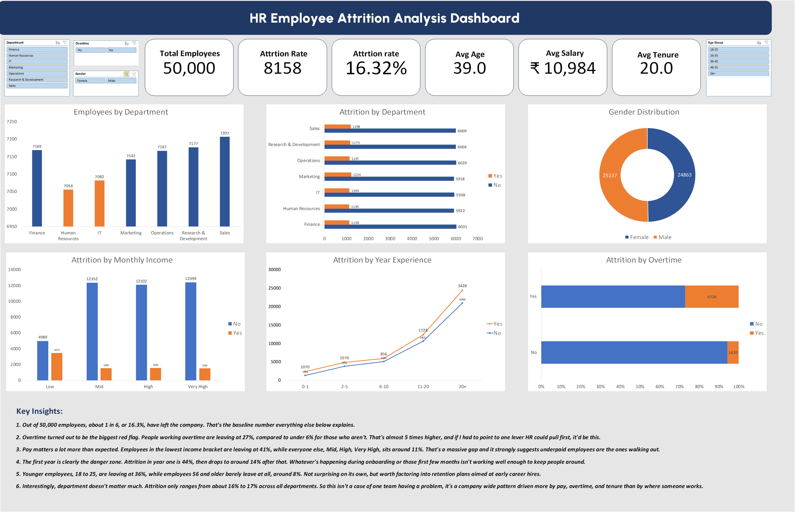

# 📊 HR Employee Attrition Analysis Dashboard
 
<div align="center">


**An end-to-end Excel data analysis project on employee attrition — featuring data cleaning, pivot analysis, GETPIVOTDATA-driven KPIs, and a fully interactive dashboard.**

</div>

---

## 📸 Dashboard Preview



---

## 📊 Analysis Preview

.png.jpg)

---

## 📌 Project Overview

Employee attrition is one of the most expensive problems an organization can face — every departure costs time, money, and institutional knowledge. This project analyzes a dataset of **50,000 employee records** to answer one core question: **what actually drives attrition here?**

Rather than treating every variable equally, the analysis compares attrition rates across department, income, tenure, age, and overtime status to identify which factors have the strongest — and weakest — effect on turnover.

This project was built entirely in **Microsoft Excel** — from raw data cleaning to a fully interactive, slicer-driven dashboard.

---

## 🗂️ Project Structure

```
hr-attrition-excel-dashboard/
│
├── HR Attrition.xlsx             # Main Excel workbook
│   ├── noisy_data                # Raw, uncleaned dataset
│   ├── clean_data                # Cleaned dataset (Power Query)
│   ├── analysis                  # Pivot tables
│   └── dashboard                 # Interactive dashboard
│
├── hr_dashboard.jpg              # Dashboard screenshot
├── analysis_sheet(hr).png.jpg    # Analysis sheet screenshot
└── README.md                     # Project documentation
```

---

## 🛠️ Tools & Excel Features Used

| Feature | Usage |
|---|---|
| Power Query | Cleaned and transformed 50,000-row raw dataset |
| Pivot Tables | 8 pivot tables summarizing attrition by department, income, tenure, age, gender, overtime |
| Pivot Charts | Column, bar, donut, and line charts |
| Slicers | Interactive filters — Department, Gender, Overtime, Age Group — connected across all pivots |
| GETPIVOTDATA | Live-updating KPI cards driven by pivot data, not static values |
| Grand Total Management | Removed Grand Total rows from chart-linked pivots to prevent skewed visuals |
| Manual Sort Ordering | Corrected alphabetical sort issues on tenure and income range fields |

---

## 📊 Dashboard Features

- **KPI Cards** — Total Employees, Attrition Count, Attrition Rate, Average Age, Average Salary, Average Tenure — all update live with slicer selection
- **Employees by Department** — Column chart showing headcount distribution
- **Attrition by Department** — Bar chart comparing stayed vs. left across departments
- **Gender Distribution** — Donut chart of workforce split
- **Attrition by Tenure** — Line chart showing attrition risk by years at company
- **Attrition by Monthly Income** — Column chart comparing attrition across income bands
- **Attrition by Overtime** — 100% stacked bar comparing overtime vs. non-overtime attrition
- **4 Slicers** — Department, Gender, Overtime, Age Group — filter every chart and KPI simultaneously

---

## 🔍 Key Insights

> **1. Overall attrition sits at 16.3%**
> Out of 50,000 employees, 8,158 have left — the baseline every other insight below explains.

> **2. Overtime is the strongest driver of attrition**
> Employees working overtime leave at 27.1%, compared to just 5.7% for those who don't — nearly 5x higher.

> **3. Low income is a major attrition risk**
> Employees in the lowest income bracket attrite at 41.0%, roughly 4x higher than Mid, High, and Very High income groups, which all sit around 11%.

> **4. The first year is the danger zone**
> Attrition in year one is 44.3%, dropping sharply to around 14% from year two onward — onboarding and early engagement are critical.

> **5. Younger employees leave far more often**
> The 18-25 age group attrites at 36.2%, compared to just 8.3% for employees 56 and older.

> **6. Department has a comparatively small effect**
> Attrition ranges narrowly from 15.9% to 17.1% across all departments — pay, overtime, and tenure matter far more than which team someone is on.

---

## 📁 Dataset

- **Total Records:** 50,000 employees
- **Columns:** Employee ID, Age, Department, Job Role, Gender, Monthly Income, Years at Company, Years Experience, Overtime, Attrition

---

## 🚀 How to Use

1. Download `HR Attrition.xlsx`
2. Open in **Microsoft Excel** (2016 or later recommended)
3. Navigate to the **dashboard** sheet
4. Use the **Department, Gender, Overtime, and Age Group slicers** to filter all charts and KPIs
5. Explore the **analysis** sheet for the underlying pivot tables
6. Check the **clean_data** sheet to see the Power Query transformation applied to the raw dataset

---

## 👤 Author

**Ibrahim Khan Mohammad**
Data Analyst | Turning Raw Data into Business Insights | Excel & SQL (in progress)

[](https://www.linkedin.com/in/ibrahimkhanmohammad/)
[](https://github.com/ibrahimkhanmohammad)

---

<div align="center">
⭐ If you found this project helpful, consider giving it a star!
</div>
